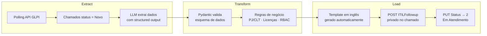

# hirings-automation

**Automação de Pedidos de Contratação** — Verdanadesk/GLPI + LLM

---

## Índice

- [Visão Geral](#visão-geral)
- [Pipeline ETL](#pipeline-etl)
- [Stack Tecnológica](#stack-tecnológica)
- [Estrutura do Projeto](#estrutura-do-projeto)
- [Arquitetura e Componentes](#arquitetura-e-componentes)
- [Variáveis de Ambiente](#variáveis-de-ambiente)
- [Como Executar](#como-executar)
- [Troubleshooting](#troubleshooting)

---

## Visão Geral

Worker em Python que monitora filas de chamados ITSM no **Verdanadesk** (baseado em GLPI), extrai dados não-estruturados de solicitações de contratação por meio de um **LLM** (OpenAI), aplica **regras de negócio Dexian** e devolve um template padronizado em inglês como acompanhamento privado.

O sistema opera como um **pipeline de ETL impulsionado por IA**, executando polling a cada 5 minutos.

---

## Pipeline ETL



---

## Stack Tecnológica

| Camada | Tecnologia | Finalidade |
|--------|------------|------------|
| Linguagem | Python 3.10+ | Runtime principal |
| LLM | `langchain-core`, `langchain-openai` | Pipeline de extração via GPT-4o-mini |
| Validação | `pydantic` | Contrato de dados tipado para output do LLM |
| HTTP | `requests` | Comunicação com API REST GLPI/Verdanadesk |
| Config | `python-dotenv` | Gestão segura de credenciais via `.env` |
| Logging | `logging` (stdlib) | Logs estruturados com timestamp e níveis |

---

## Estrutura do Projeto

```
hirings-automation/
├── .env                 # Credenciais e configurações (não commitado)
├── .rules               # Diretrizes de atuação da IA
├── automation.py         # Worker principal (ponto de entrada)
└── README.md            # Esta documentação
```

---

## Arquitetura e Componentes

### 1. `DadosColaborador` — Contrato de Dados

Classe `pydantic.BaseModel` que define o esquema estrito de saída do LLM. Se o modelo falhar na estruturação, o Pydantic rejeita a resposta.

| Campo | Tipo | Descrição |
|-------|------|-----------|
| `nome_completo` | `str` | Nome completo do colaborador |
| `is_pj` | `bool` | `True` se PJ, cooperado ou consultoria externa |
| `data_inicio_dd_mm_yyyy` | `str` | Data de início no formato `DD-MM-YYYY` |
| `cargo_ingles` | `str` | Cargo traduzido para o inglês corporativo |
| `centro_custo` | `str` | Centro de custo / departamento |
| `cidade_escritorio` | `str` | Cidade do escritório de alocação |
| `telefone` | `str` | Telefone de contato |
| `gestor_nome` | `str` | Nome do gestor direto |
| `fornecedor_equipamento` | `str` | `DEXIAN` ou `CLIENTE` |

### 2. `GeradorDeChamado` — Motor de Regras de Negócio

Consome um `DadosColaborador` e aplica as lógicas empresariais:

- **Regra PJ/Cooperado:** e-mail com sufixo `-ext`, lista de distribuição reduzida.
- **Regra de Equipamento:**
  - `DEXIAN` → Licença Microsoft F3, RBAC completo, laptop `Y`.
  - `CLIENTE` → Licença Microsoft Kiosk, RBAC cloud-only, laptop `N`.
- **Formatação:** datas `DD-MM-YYYY` → `MM/DD/YY`, remoção de acentos, telefone padronizado `+55`.

### 3. `VerdanadeskAutomator` — Orquestrador de I/O

| Responsabilidade | Método |
|-----------------|--------|
| Autenticação + renovação de sessão | `_iniciar_sessao`, `_renovar_sessao` |
| Polling de chamados novos | `buscar_novos_chamados` |
| Pipeline completo por ticket | `processar_chamado` |
| Configuração do LangChain | `_criar_extrator_chain` |

---

## Variáveis de Ambiente

Crie um arquivo `.env` na raiz do projeto com as seguintes variáveis:

| Variável | Descrição | Exemplo |
|----------|-----------|---------|
| `VERDANADESK_URL` | URL base da API REST do Verdanadesk | `https://empresa.verdanadesk.com/apirest.php` |
| `USER_TOKEN` | Token do utilizador GLPI | `clIChS5lG9CHLVrj...` |
| `APP_TOKEN` | Token da aplicação API GLPI | `a1b2c3d4e5f6...` |
| `OPENAI_API_KEY` | Chave de API da OpenAI | `sk-proj-...` |
| `CATEGORIA_CONTRATACAO_IDS` | IDs das categorias ITIL (separados por vírgula) | `152,153` |

```dotenv
VERDANADESK_URL=https://empresa.verdanadesk.com/apirest.php
USER_TOKEN=seu_token_aqui
APP_TOKEN=seu_app_token_aqui
OPENAI_API_KEY=sk-proj-sua-chave-aqui
CATEGORIA_CONTRATACAO_IDS=152,153
```

---

## Como Executar

### 1. Crie o ambiente virtual

```bash
python -m venv .venv
```

### 2. Ative o ambiente

```powershell
# Windows (PowerShell)
.\.venv\Scripts\Activate.ps1
```

```bash
# Linux / macOS
source .venv/bin/activate
```

### 3. Instale as dependências

```bash
pip install requests pydantic langchain-core langchain-openai python-dotenv
```

### 4. Configure o `.env`

Copie o exemplo acima e preencha com suas credenciais.

### 5. Inicie o worker

```bash
python automation.py
```

O worker executará em loop contínuo, consultando as filas a cada **5 minutos**.

---

## Troubleshooting

| Sintoma | Causa Provável | Solução |
|---------|---------------|---------|
| `SystemExit` no startup | Variável de ambiente ausente | Verifique se todas as variáveis do `.env` estão preenchidas |
| `401 Unauthorized` | Token expirado ou inválido | O worker tenta renovar automaticamente; valide `USER_TOKEN` e `APP_TOKEN` |
| `Timeout` nas requisições | API lenta ou indisponível | O timeout padrão é 30s; verifique a conectividade com o Verdanadesk |
| `Formato de data inesperado` | RH digitou data fora do padrão `DD-MM-YYYY` | O valor original é mantido; corrija manualmente no chamado |
| LLM retorna dados inválidos | Texto do chamado ambíguo ou incompleto | O Pydantic rejeita a saída; o ticket é logado como erro e o loop continua |

---

> Documentação otimizada para ingestão de contexto por agentes LLM e revisão de código por pares.
